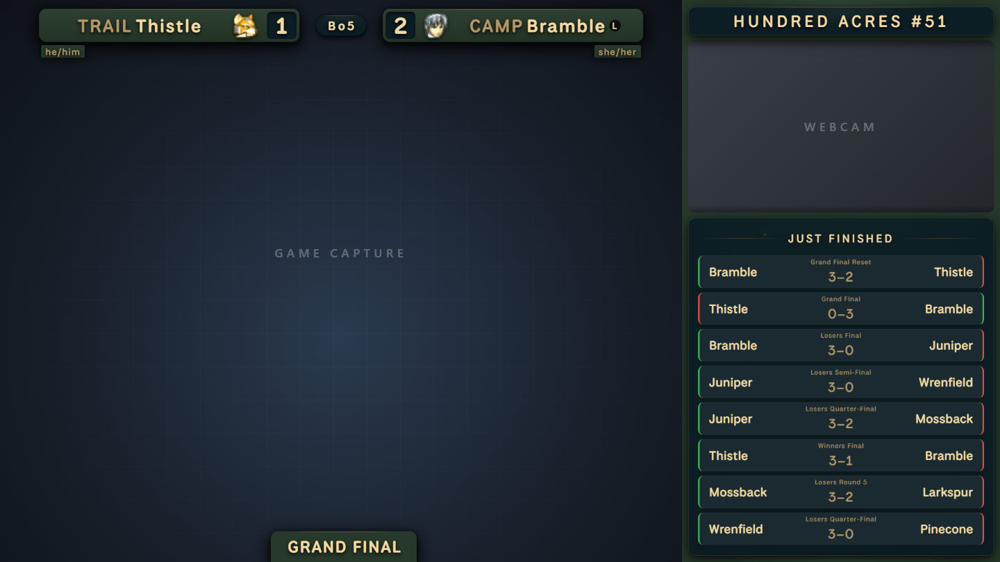
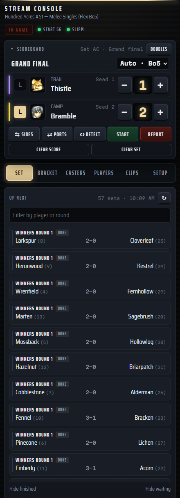
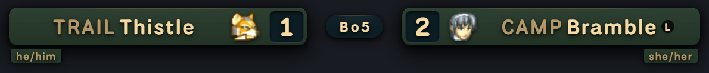
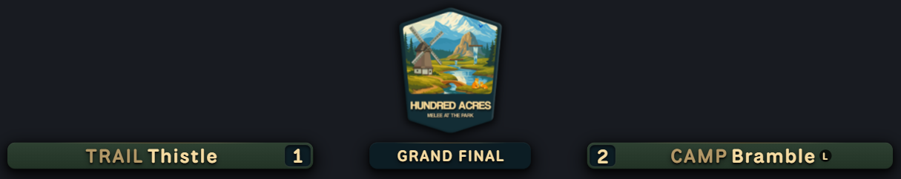
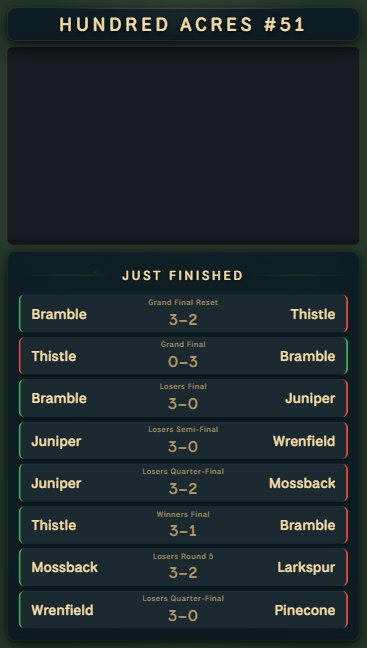
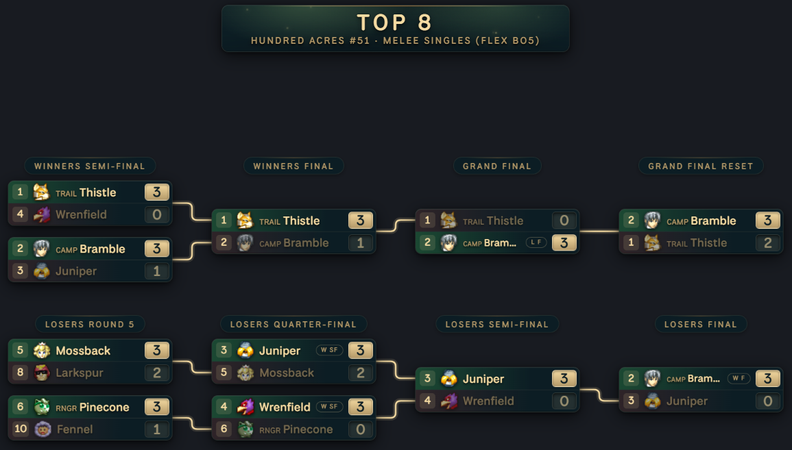
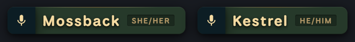
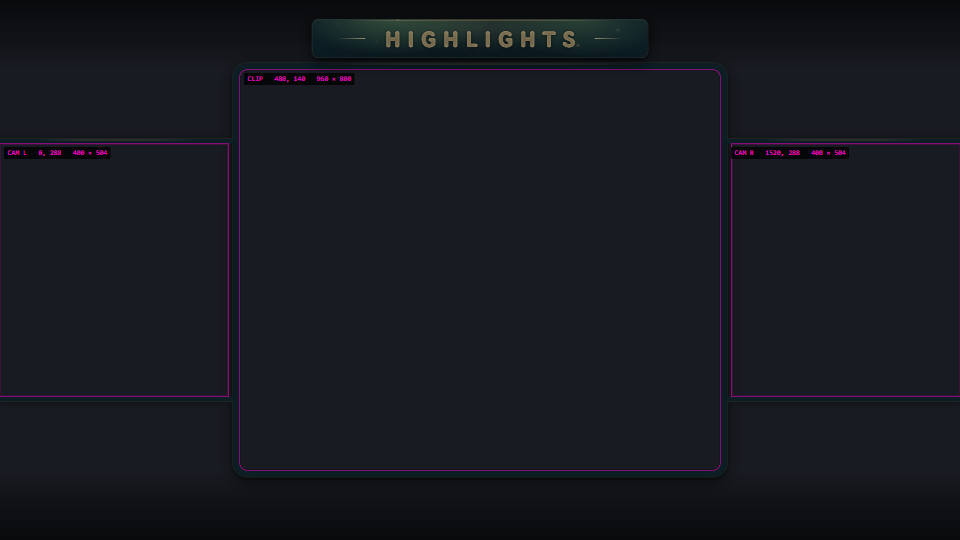
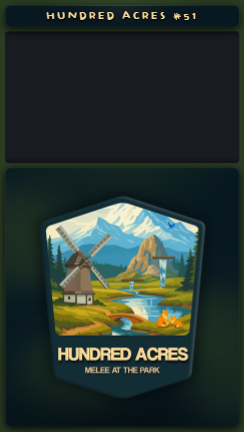
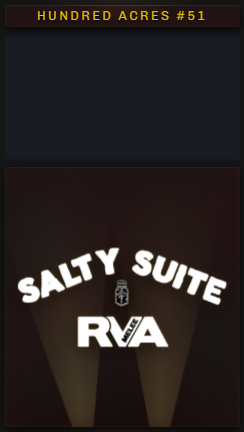

<div align="center">

# slippi-stream-overlay

**One app that runs a Super Smash Bros. Melee tournament stream.**

It reads live Slippi games, runs the bracket from start.gg, keeps the scoreboard,<br>
serves every OBS overlay, and gives the stream operator one panel to drive it all from.




<sub>The scoreboard and side panel on stream. The game capture and webcam are placeholders.</sub>

</div>

---

## Why use it

- 🎮 **Scores update by themselves.** Characters, costumes and the winner of each game come straight from Slippi as the game is played.
- 🏆 **The bracket comes from start.gg.** Load the next set in one tap, then press **Report** when it's done. Nobody has to open the bracket page.
- 🖥️ **Six OBS overlays, one look.** The scoreboard, side panel, bracket, casters and replay frame all share a theme pack you can swap.
- 🎬 **Combos clip themselves.** When a big combo lands, OBS saves its replay buffer, and the clips play back on your break scene.
- 🧠 **It learns your players.** Pronouns and mains are kept in a player database, and mains are learned from what people actually play.

It replaced [Tournament Stream Helper (TSH)](https://github.com/joaorb64/TournamentStreamHelper), which this repo used to feed. Now there's only one thing to run.

---

## Contents

| Getting started | Using it | Reference |
|---|---|---|
| [Requirements](#requirements) | [The dock](#the-dock) | [Theme packs](#theme-packs) |
| [Quick start](#quick-start) | [How scoring works](#how-scoring-works) | [Combo clipper](#combo-clipper) |
| [Adding it to OBS](#adding-it-to-obs) | [Reporting to start.gg](#reporting-to-startgg) | [Troubleshooting](#troubleshooting) |
| | [The overlays](#the-overlays) | [For developers](#for-developers) |

---

## Requirements

| You need | Why |
|---|---|
| [**Node.js 18+**](https://nodejs.org) | Runs the app. |
| **Slippi Desktop App** | Set to spectate/mirror mode, so it writes live `.slp` files to a folder. |
| **OBS 28+** | Version 28 has obs-websocket v5 built in, which the [combo clipper](#combo-clipper) uses. |
| *Optional:* **64-bit VLC** and a Python that OBS will load | Only for the break-scene clip playlist ([details](#playing-clips-back)). |

---

## Quick start

> [!TIP]
> Setting up a **new machine**, a **fresh OBS profile**, or **moving over from TSH**? Follow [docs/FRESH-INSTALL.md](docs/FRESH-INSTALL.md) instead. It's an ordered checklist with a verification pass at the end.

### 1 · Clone

```bash
git clone https://github.com/quinnogden/slippi-stream-overlay.git
```

### 2 · Add your settings

Copy `app/config.local.example.js` to **`app/config.local.js`** and fill in two values:

```js
module.exports = {
  STARTGG_TOKEN: "…",   // start.gg → Developer Settings
  SLP_FOLDER: "C:/Users/YourName/Documents/Slippi/Spectate/YourName",
};
```

- **`STARTGG_TOKEN`**: create one at [start.gg → Developer Settings](https://start.gg/admin/profile/developer). You can only view it once, and it expires after a year. Without it, brackets still load, but **Start**, **Report** and the side panel's player stats are turned off.
- **`SLP_FOLDER`**: the folder Slippi writes live games into. The app won't start if this folder doesn't exist.

> [!WARNING]
> Put the token in `config.local.js` only, never in `config.js`. `config.local.js` is gitignored; `config.js` is committed.

<details>
<summary><b>Other settings</b> (all optional, with working defaults)</summary>

<br>

| Setting | Where | What it does |
|---|---|---|
| `BRACKETS` | `config.js` | Your series' start.gg short link, for the [Singles / Doubles buttons](#switching-brackets). |
| `PLAYERS_FILE` | `config.js` | Moves the player database. The default is `app/data/local_players.json`. |
| `HOTKEYS` | `config.local.js` | Changes the [global hotkeys](#hotkeys). |
| `SET_TEXT` | `config.local.js` | Changes the Flex / Bo5 rule. |
| `CLIPPER` | `config.local.js` | Starting values for the [combo clipper](#combo-clipper). After that, tune it from the dock. |
| `BRIDGE_PORT` | `config.local.js` | The port everything is served on (default **5001**). |

Anything specific to one machine goes in `config.local.js`.

</details>

### 3 · Set up the player database *(optional)*

Players are kept in `app/data/local_players.json`, which records each player's tag, prefix, pronouns, twitter and mains. **You don't need this file to start.** Players are added from start.gg as their sets load, and their mains are learned as they play.

- **Coming from TSH?** Copy the old install's `user_data/local_players.json` here. The format works in both directions.
- **Want regulars correct from their first set?** Copy [`local_players.example.json`](app/data/local_players.example.json) to `local_players.json` and replace the sample players with your own.

Every field is described in [Starting from scratch](docs/FRESH-INSTALL.md#starting-from-scratch--no-tsh-data).

### 4 · Run it

Double-click **`start.bat`**. The first run installs the dependencies.

The console then shows the dock's address, addresses for a phone, the player file, the event it loaded and the hotkeys it bound. **Close the window to stop the app.**

> [!NOTE]
> Want to check your setup? Run `cd app && node scripts/preflight.js`. It tests the config, the player file, the overlays, the theme, the hotkeys, start.gg and OBS, and prints a fix for anything that fails.

---

## Adding it to OBS

### Browser sources

Add each overlay as a **Browser Source**. You don't need to type these: the dock's **Setup** tab lists every URL with a copy button.

| Source | URL | Size |
|---|---|---|
| Scoreboard | `http://localhost:5001/o/scoreboard` | 1920 × 1080 |
| Players bar | `http://localhost:5001/o/scoreboard/players` | 1920 × 1080 |
| Side panel | `http://localhost:5001/o/side-panel` | 611 × 1080 |
| Bracket | `http://localhost:5001/o/bracket` | 1920 × 1080 |
| Highlights | `http://localhost:5001/o/highlights` | 1920 × 1080 |
| Casters | `http://localhost:5001/o/casters` | any |

> [!IMPORTANT]
> On **every** browser source, uncheck **"Shutdown source when not visible"** and **"Refresh browser when scene becomes active"**.
>
> Start the app **before** OBS. If OBS was already open, refresh the sources once the app is up.

The side panel has a transparent 587 × 330 cutout for your webcam, so put the webcam source **behind** it.

### Custom dock

Go to **Docks → Custom Browser Docks** and add `http://localhost:5001/dock`.

---

## The dock



The dock is the operator's whole job in one narrow panel. It sits beside the OBS preview and **never appears on stream**.

It also works in a browser, where it widens into columns, or **on a phone**. Use the address the console prints; the Tailscale address is listed first because it keeps working when the venue Wi-Fi changes.

### The live strip

This strip stays pinned at the top and shows:

- **Both players**: tag, prefix and character. Tap a character to open a picker laid out like the character-select screen. Hold or right-click a character to choose a costume.
- **The score**, with **−** / **+** for each side.
- **The round, best-of and [L] marks**. Each can be overridden, and **Auto** puts them back.

And these buttons:

| Button | What it does |
|---|---|
| **⇆ Sides** | The players swap columns on the scoreboard. Use it to match where they actually sit. |
| **⇄ Ports** | Fixes ports that are the wrong way round, before a point goes to the wrong player. The scoreboard doesn't move. |
| **↻ Detect** | Matches the ports to the players' characters again. |
| **Start** / **Report** | start.gg's "Start match" and the result report. See [Reporting](#reporting-to-startgg). |

### The tabs

| Tab | What's in it |
|---|---|
| **Set** | The event's sets, with **playable sets first**. Tap one to put it on the scoreboard. Use **Clear set** for friendlies. |
| **Bracket** | **Singles** / **Doubles** for this week's event, and which view the bracket overlay shows. |
| **Casters** | Up to four casters. Edits are a draft until you press **Put on stream**. |
| **Players** | Search the player database, fix a prefix or pronoun, and **pin** a player's main. |
| **Clips** | The combo clipper: on/off, the OBS connection, thresholds, recent clips, and **Test clip**. |
| **Setup** | Every OBS URL, the phone URLs, the hotkeys, and where the files are. |

<br clear="right">

### Hotkeys

The hotkeys are **global**, so they work in whichever window has focus (OBS, Dolphin, a browser).

| Action | Default |
|---|---|
| Swap ports | <kbd>Ctrl</kbd>+<kbd>Shift</kbd>+<kbd>S</kbd> |
| Switch sides | <kbd>Ctrl</kbd>+<kbd>Shift</kbd>+<kbd>X</kbd> |
| Game to left / right | <kbd>Ctrl</kbd>+<kbd>Shift</kbd>+<kbd>1</kbd> / <kbd>2</kbd> |
| Take a game away | <kbd>Ctrl</kbd>+<kbd>Shift</kbd>+<kbd>Alt</kbd>+<kbd>1</kbd> / <kbd>2</kbd> |
| Clear the score | <kbd>Ctrl</kbd>+<kbd>Shift</kbd>+<kbd>0</kbd> |

<details>
<summary>Changing hotkeys, and what happens if they can't load</summary>

<br>

- Change each action with `HOTKEYS` in `config.local.js`. Every chord needs Ctrl, Alt or Win, and `null` turns a hotkey off.
- Modifiers must match exactly, and holding a key down fires it once.
- If the `uiohook-napi` native module can't load, the app falls back to single keys typed into its own console window (`s` `x` `1` `2` `q` `w` `0`). The Setup tab tells you when this happens.

</details>

---

## How scoring works

### The score is a list of games

Each time Slippi reports a game's end, the winning side gets a game. **−** and **+** remove or add one by hand. Because the score *is* that list:

- the report sent to start.gg always matches what's on screen, and
- **⇆ Sides** moves names, scores and games together.

### Which port is which player

At the start of every game, the app decides which side each Slippi port plays for:

1. **Same ports as last game?** They keep their sides, so a manual **⇄ Ports** fix lasts for the rest of the set.
2. **Match by character.** Each port's character is compared with the players' mains (game 1) or the characters from the last game. If both players are on the same character, the costume breaks the tie.
3. **Fall back to position.** The lower port goes on the left. The dock marks this in **amber** as a guess to check before game 1 ends.

The winner is read **at the end of the game**. So if you fix the ports or load the right set partway through a game, the point still goes to the right player.

### Mains are learned

When a singles set ends, the characters each player used are saved to the player database, most-played first. Their next set opens on the right character, and game 1's ports match the first time. A **pinned** main (set in the Players tab) always wins.

### Warm-ups and rage quits

- **Handwarmers don't count.** Each game is checked for warm-up signs: little damage dealt, both players still on more than one stock, a quit-out (LRAS), and a length under 60 seconds. With enough of them, the game is treated as a warm-up: the characters still update, but the score doesn't.
- **Rage quits do count.** If someone quits out of a real game, the point goes to the other player (in doubles, the other *team*).

### Doubles

Doubles is detected automatically when a game has four players on Slippi teams. Each side shows its team colour (red, blue or green), and the side panel skips the per-player cards. Clips and learned mains are singles only.

---

## Reporting to start.gg

When a set loaded from start.gg is finished, press **Report**. The dock shows the winner and score and **asks before sending anything**; reporting is always manual. It sends every game's winner, so start.gg shows the real score.

**Start** handles the other end: it presses start.gg's "Start match" for the set you just loaded. It only shows while start.gg still lists the set as not started or called.

<details>
<summary>Why is Report greyed out?</summary>

<br>

The dock always shows the reason. The usual causes are:

- No start.gg token.
- A manual set (not loaded from start.gg).
- **The bracket hasn't been started on start.gg yet.** Until the TO starts it, every set is a `preview_…` placeholder. Load the set again once the bracket starts.
- The score is tied.

</details>

### Switching brackets

If your stream switches between singles and doubles, the Bracket tab's **Singles** and **Doubles** buttons load the right event in one press, every week.

`BRACKETS` in `config.js` holds your series' **short link** (e.g. `start.gg/100-acres`, hyphenated exactly as it appears) and a few keywords per format. The TO points that short link at each new tournament, and the app follows it. If the keywords match two events, the app **refuses and names both** rather than guessing.

Switching never touches the scoreboard, so a set in progress is safe.

---

## The overlays

### Scoreboard



The scoreboard shows names, prefixes, pronouns, the live character and costume, scores, the round and the best-of.

- **Best-of** is set automatically: **Flex** outside top 6 (a Bo3 that becomes a Bo5 at 1–1) and **Bo5** in top 6. To change the rule, edit `lib/scoreboard/set-text.js`, or set `SET_TEXT` in `config.local.js`.
- **[L]** goes on the grand-finals player who came from losers.
- The live strip can override any of this for one set.

### Players bar



The same information in a bar along the bottom, with the tournament logo above the round. It's at `/o/scoreboard/players`.

### Side panel



A 611 × 1080 panel that sits beside the webcam. The header shows the tournament name. The bottom card rotates every 20 seconds through:

- the tournament logo
- each player's recent placements and current run
- their head-to-head record
- the sponsor logo
- the event's just-finished sets

Player stats come from start.gg. Each player's full set history is downloaded once and saved, so a regular's card appears seconds after their set loads.

When the combo clipper saves a clip, a pill naming the player and the combo slides in over the bottom card.

Doubles skips the player cards and head-to-head.

<br clear="right">

### Bracket



One source with five views: **Winners · Losers · Top 8 · Top 16 · Full**. Switch between them from the dock, and the overlay crossfades. Add `?view=top8` to a source's URL to keep it on one view.

- Each view **scales to fit**. If it would get too small to read, it **pans slowly** instead.
- Sets show seeds, scores and character icons. The winners' paths light up in the theme's accent colour.
- A player dropping into losers gets a small tag ("from W-R2") instead of a line across the screen.

### Casters



One name tag per caster, showing the mic icon, prefix, tag and pronouns. `/o/casters` shows them all in a row. Add `?i=0`, `?i=1`, … to show one caster per source, so each tag can sit under that caster's cam.

### Highlights (replay scene frame)



A frame for your replay scene: a title, a clip window and two player cams. It's **decoration only**. It doesn't know which clip is playing.

The frame has to line up with your OBS sources. Instead of editing CSS, copy the numbers from OBS's **Edit Transform** into the URL:

```text
?clip=x,y,w,h        the clip window
?cam=y,w,h           both cams (they share these; only x differs)
?camx=leftX,rightX   each cam's x position
?pad=clipPad,camPad  frame thickness
```

Add **`?guides=1`** to outline each window with its size, as in the screenshot above, and compare it with OBS. Add `?animate=false` to any overlay to switch off its animation.

---

## Theme packs

A theme is one self-contained folder, so moving to a different tournament's branding doesn't mean editing every overlay.

<table>
<tr>
<td align="center"><br><code>hundred-acres-s2</code><br><sub>on air · fireflies</sub></td>
<td align="center"><br><code>hundred-acres</code><br><sub>season one · drifting orbs</sub></td>
<td align="center"><br><code>salty-suite</code><br><sub>orbs and spotlights</sub></td>
</tr>
</table>

**To switch themes:** use the dock's **Setup → Theme**. Every overlay fades out and reloads in the new theme.

The choice is stored in `overlays/theme.css`, a one-line file that names the active pack:

```text
overlays/theme.css                  ← one @import line naming the active pack
overlays/themes/hundred-acres-s2/
  theme.css                         colours, fonts, the two logo URLs
  flair.css                         animated background details (optional)
  logo.png                          tournament logo
  sponsor.png                       sponsor / venue logo
  fonts/                            the brand font, stored locally
```

**To make a new theme:** copy a pack folder, change its colours and artwork, then pick it in the dock.

> [!CAUTION]
> - **Switch back afterwards.** Nothing reminds you, and the wrong branding is only obvious once you're live.
> - **When copying a pack**, the two logo URLs inside its `theme.css` contain the folder name and must be updated. Preflight fails if they don't resolve.

---

## Combo clipper

The app spots notable combos **while the game is being played** and tells OBS to save its replay buffer, so the clip exists by the time the stock is over. `obs-scripts/auto_replays.py` then plays those clips back on your break scene.

> [!NOTE]
> **Clips are singles only.** Slippi's stats library only computes combos for 2-player games. That's upstream and can't be worked around, and the dock tells you so.

### Setup

1. **OBS → Settings → Output → Replay Buffer**: turn it on and set it to **20 seconds or more**. Combos often run 6–9 seconds, and the app waits a couple more so the kill makes it into the clip.
2. **OBS → Tools → WebSocket Server Settings**: turn it on, and note the port (4455) and password.
3. In the dock's **Clips** tab, enter the WebSocket address, the password and your replay folder, then press **Save settings**.
4. Turn the clipper **on** and press **Test clip**. A clip should appear in the folder and in the recent list.

> [!TIP]
> Press **Test clip** before every bracket. It checks the whole chain in one press.

<details>
<summary><b>Tuning the thresholds</b></summary>

<br>

Every setting can be changed live from the Clips tab, without a restart. Your changes are saved to `app/clipper-settings.json`, which is gitignored because it holds the OBS password.

| Setting | What it does |
|---|---|
| **Min moves** / **Min damage** | How big a combo has to be to count. |
| **Require kill** | Only clip combos that take a stock. |
| **Combo window** | Only judge the *last* N seconds of a combo (see below). |
| **Cooldown** | The minimum gap between saves, so one exchange doesn't make five near-identical clips. |
| **Max clips per game** | A cap for blowouts. `0` means no limit. |
| **Save delay** | How long to wait after a combo is spotted, so the kill animation is in the clip. |
| **Notify side panel** | Shows the "clip saved" pill on stream. |

**The combo window is the setting worth understanding.** Slippi treats a combo as one long event until the victim gets back to neutral or dies, so an offstage chase can count as a single 30-second combo that's mostly empty air. Judged as a whole, it qualifies on an opening burst that has already left the replay buffer by the time the clip is saved.

Set a window of **8–10 seconds** (comfortably shorter than your buffer), and only the final seconds are measured. The footage that qualifies is then the footage that gets saved.

</details>

### Playing clips back

1. Add a **VLC Video Source** (needs 64-bit VLC) or a **Media Source** to your break scene.
2. Load `obs-scripts/auto_replays.py` from **OBS → Tools → Scripts**, then point it at your replay folder and that source.

Whenever you switch to the scene, it builds a playlist from the newest clips.

> [!WARNING]
> Check the **Python Settings** tab in the Scripts window first. OBS only loads certain Python versions, and the newest one you have installed may not be one of them.

---

## Troubleshooting

> [!TIP]
> **Start with preflight:** `cd app && node scripts/preflight.js`. It checks almost everything below and prints the fix for each failure.

| Problem | Fix |
|---|---|
| **The app closes right after starting** | `SLP_FOLDER` doesn't exist on this machine. Set it in `config.local.js`. |
| **"Port already in use"** | Usually handled for you: an older copy of the app is stopped automatically. If a *different* program is on port 5001, the app refuses to start. Free the port (`netstat -ano \| findstr :5001`, then `taskkill /PID <pid> /F`) or change `BRIDGE_PORT`, and update every OBS source to match. |
| **An OBS source is blank** | It loaded while the app was off. Refresh the source. A `localhost:5000/layout/…` URL is TSH's old address; use the [new URLs](#browser-sources). |
| **Points go to the wrong player** | Press **⇄ Ports** (<kbd>Ctrl</kbd>+<kbd>Shift</kbd>+<kbd>S</kbd>). If the *names* are on the wrong sides, use **⇆ Sides** instead. |
| **Players have no character or pronouns** | There's no player file; the console warns about this at startup. See [the player database](#3--set-up-the-player-database-optional). |
| **An overlay has no styling or is missing a logo** | `overlays/theme.css` names a theme pack that isn't there. Preflight tells you which. |
| **Report or Start is greyed out** | The dock shows why. See [Why is Report greyed out?](#reporting-to-startgg) |
| **No clips are saved** | Most likely causes, in order: it's a doubles set, the replay buffer isn't running, or the thresholds are too high. **Test clip** tells an OBS problem apart from a threshold problem. |
| **Clips start partway through the combo** | The replay buffer is shorter than 20 seconds. |
| **The highlights frame doesn't line up** | Add `?guides=1` and compare the labels with OBS's Edit Transform values. |
| **A warm-up game was scored** | Take it back with **−** (or <kbd>Ctrl</kbd>+<kbd>Shift</kbd>+<kbd>Alt</kbd>+<kbd>1</kbd>/<kbd>2</kbd>). The warm-up cutoff is at the top of `app/lib/handwarmer.js`. |

---

## For developers

### How it fits together

```text
Slippi Desktop App ──► live .slp files in SLP_FOLDER
                              │  (checked every 500 ms)
                              ▼
          ┌────────────────── app/ ──────────────────┐     start.bat
          │  game reading · scoreboard · player DB   │
          │  start.gg (event, sets, report, stats)   │◄──► start.gg
          │  OBS (replay buffer saves)               │◄──► OBS
          └──────────────┬──────────────┬────────────┘
                         ▼              ▼
              /o/…  OBS overlays    /dock  operator panel
```

Everything is served from one port (**5001** by default).

### What's in the repo

| Path | What it is |
|---|---|
| [`app/`](app/) | The app: game reading, the scoreboard, start.gg, the player DB, OBS, and the dock (`public/dock/`). |
| [`overlays/`](overlays/) | Every OBS page, the theme packs, and the character icons. Served at `/o/`. |
| [`obs-scripts/`](obs-scripts/) | Python scripts that run *inside* OBS: the break-scene clip playlist. Optional. |
| [`tests/`](tests/) | `node tests/run.js`. No framework, nothing to install. See [tests/README.md](tests/README.md). |
| [`docs/`](docs/) | The longer guides below. |
| `start.bat` | Starts the app, and installs dependencies on the first run. |

### Further reading

| Doc | Read it when you're… |
|---|---|
| [docs/FRESH-INSTALL.md](docs/FRESH-INSTALL.md) | setting up a machine step by step, including moving over from TSH |
| [docs/TESTING.md](docs/TESTING.md) | checking a change with no bracket running |
| [docs/BRIDGE-API.md](docs/BRIDGE-API.md) | changing the state, events or `/api/*` routes the overlays and dock use |
| [CLAUDE.md](CLAUDE.md) | changing the code: the architecture and the non-obvious rules behind it |
